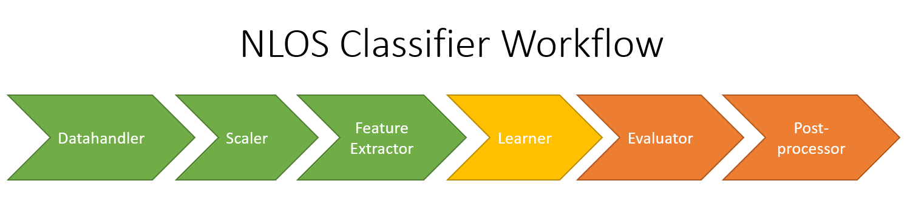

# nlos_classifier

## Workflow

The project consists out of several modules which are mostly represented by a single class. The general workflow which uses these modules is visualised in the following illustration.

### Datahandler
Class files: <em>nlos_datahandler.m</em> and <em>nlos_datahandler_cnn.m</em>
   
The datahandlers take raw datafiles as input and generate a datatable. They currently support four tours (AMS_01, AMS_02, ROT_01, ROT_02). To add a new tour, see the <em>nlos_datahandler.init_AMS_01()</em> method as an example of the required input information. Most importantly, two .mat structs are required. One is the output of the fisheye camera project (e.g. <em>outputVars_EXP01_AMS_2018.mat</em> in the AMS_01 data folder), the other is the data extracted from PNT2 (e.g. <em>PNT2data.mat</em> in the AMS_01 data folder, which was extracted using the <em>AMS_01_retrieve_PNT2_data.m</em> file in the same folder). To extract PNT2 data, the PNT2 tool should first be run with the correct config file.

### Scaler
Class file: <em>nlos_scaler_minmax.m</em>

The minmax scaler scales in the given input variables to the range [0, 1], and does this separately for each constellation. Scaling variables is not always required, however highly recommended in most cases. It's important to initialise the scaler only with the training dataset, and then to scale all sets (training, validation and testing) with the same scaler. As the learners can have no knowledge of validation/testing data, this data cannot be used to influence the average of a variable in the training data etc.

### Feature Extractor
Class file: <em>nlos_feature_extractor.m</em>

Once the data records (think in terms of <strong>rows</strong> in the table) are prepared, it is now time to select our input features (think <strong>columns</strong>) which we will feed to our learner. The features can be the standard observable variables present in the table (e.g. pseudorange, elevation...) but they could also be transformations of (multiple) such observational data.

### Learner
Class files and scripts: <em>nlos_models.m</em> and <em>nlos_learners_XXX.m</em>

The machine learning algorithm will be trained on training data and testing on new testing data. In case of neural networks, validation datasets can be provided for regularisation (more specifically, early stopping). As some learners require input data to be provided in different formats, the feature extractor provides alternative methods to this end. Specifically, there are deep learning methods present to provide the predictors and response variable for neural networks. 

The <em>nlos_learners_XXX.m</em> scripts should be considered as examples. The main idea behind all modularity present in this project is that such scripts can easily be constructed to meet a developer's needs. In other words, such a script uses all other modules. Alternatively, the other modules hide the abstraction and allow these scripts to be highly comprehensive and easily modifiable. It then becomes possible to efficiently evaluate effect of new datasets, scaling, different features, different learners, use of other evaluation schemes etc.

### Evaluator
Class file: <em>nlos_performance.m</em>

The performance class provides functionality to quickly evaluate the classification result of a learner. There are multiple examples of how to use this class and it's methods in the learner scripts.

### Postprocessor
Class file: <em>nlos_postprocessing.m</em>

The postprocessor provides output files for the nlos_classifier project. Currently, the postprocessor can be used to produce a datatable (in csv format) of the unscaled data together with the machine learning hard and soft labelling.

## Data exploration

In the <em>R scripts</em> folder, the <em>explore_a_tour.R</em> file is an R script which can be used to produce a good statistical analysis of the base variables. To this end, a datatable should be provided as produced by the datahandler module.
